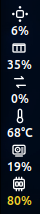
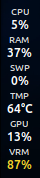
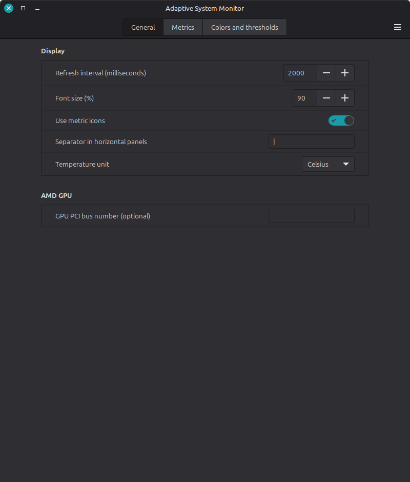
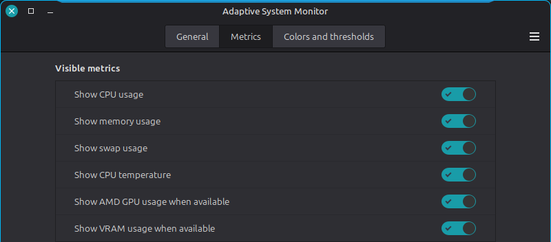
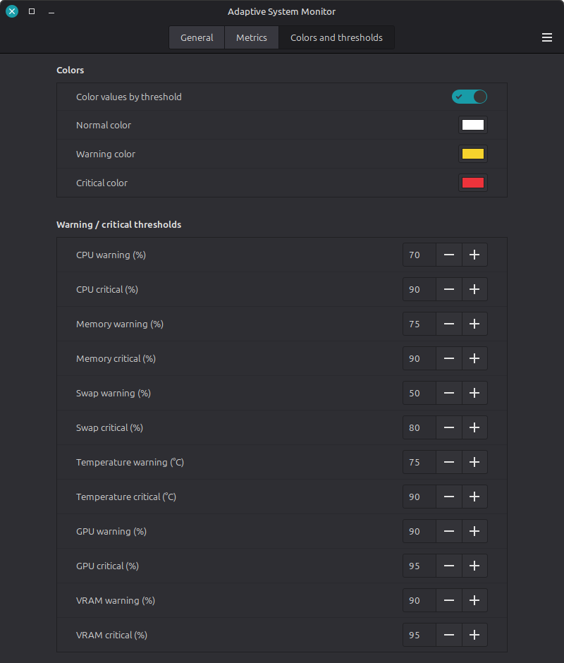

# Adaptive System Monitor

A Cinnamon applet that combines CPU, memory, swap, CPU temperature, AMD GPU
and VRAM monitoring in one panel item. Its layout follows the panel
orientation automatically.

| Icons (default) | Text labels |
| --- | --- |
|  |  |

- Horizontal panels show a compact single row.
- Vertical panels stack metrics and keep every value narrow enough for a
  40 px panel.
- Choose metric icons or short text labels with a native settings switch.
- CPU, memory, swap and temperature data come directly from Linux `/proc` and
  `/sys` interfaces.
- AMD GPU and VRAM data use `radeontop`.
- GPU and VRAM disappear automatically when `radeontop` or supported GPU data
  is unavailable, and each can also be disabled explicitly in the settings.
- Warning and critical thresholds, colors and visible metrics are configurable
  through Cinnamon's native applet settings.
- The click menu includes system-monitor launchers and a `Restart Cinnamon`
  action inherited from the Combined Monitor workflow.

## Settings

All options are available through Cinnamon's native three-tab settings dialog.

### General



### Metrics



### Colors and thresholds



## Requirements

Cinnamon 5.8 or newer is supported. AMD GPU metrics require `radeontop`:

```bash
sudo apt install radeontop
```

The CPU, memory, swap and CPU-temperature metrics work without `radeontop`.

## Installation

```bash
git clone https://github.com/ClaudiuSchuster/cinnamon-system-monitor.git
cd cinnamon-system-monitor
./install.sh
```

Then open **System Settings → Applets**, add **Adaptive System Monitor** to a
panel and remove the separate Combined Monitor / AMD GPU Monitor instances if
you no longer need them. Existing settings of those applets are not changed.

Run `./install.sh` again after an update. Run `./uninstall.sh` to remove the
applet files; user settings are deliberately retained.

## Development

```bash
make check
```

The checks validate JavaScript syntax, metric parsers, JSON schemas, SVG
assets and shell scripts.

## Origin and license

The project combines and reworks ideas from **Combined Monitor** by
`d-atoshi` and **AMD GPU Monitor** by `axel358`, both distributed in Linux
Mint's `cinnamon-spices-applets` repository. See `ATTRIBUTION.md` for details.

Licensed under GPL-3.0-or-later. See `LICENSE`.
